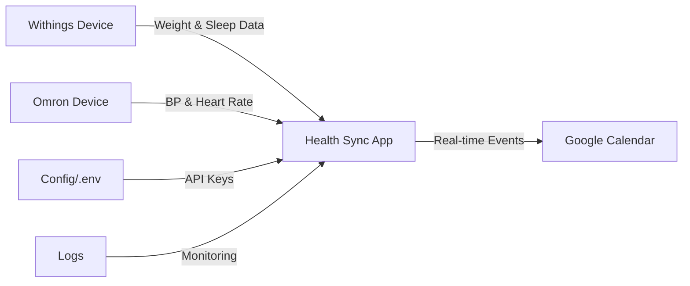

# Health Data → Google Calendar Integration

A Python-powered health data synchronization system that automatically transfers your Withings and Omron health metrics to Google Calendar.


## 🔄 System Overview



## ⚡ Quick Start

```bash
# 1. Clone & Setup
git clone https://github.com/Kakachia777/health-data-sync.git
cd health-data-sync

# 2. Create Virtual Environment
python -m venv venv
source venv/bin/activate  # Windows: venv\Scripts\activate

# 3. Install Dependencies
pip install -r requirements.txt

# 4. Configure & Run
# Add credentials to config/.env
python src/main.py
```

## 🌟 Key Features

### 📊 Data Sources
```
Withings Device
└── 📈 Weight Measurements
└── 😴 Sleep Tracking
    
Omron Device
└── ❤️ Blood Pressure
└── 💓 Heart Rate
```

### 🔄 Sync Process
```
Data Collection → Validation → Processing → Calendar Event Creation
     ↑              ↑            ↑               ↑
Real-time      Error Check    Convert      Event Formatting
```

### 🛡️ System Features
```
Security         Performance       Reliability
   ↓                ↓                ↓
OAuth2 Auth    Rate Limiting    Auto-Retry
   ↓                ↓                ↓
Token Mgmt     Batch Updates    Error Logs
```

## 📂 Project Structure

```
health-data-sync/
├── 📱 src/
│   ├── main.py ────────────→ Application Entry
│   ├── config.py ──────────→ Settings Manager
│   ├── withings_handler.py ─→ Withings Integration
│   ├── omron_handler.py ───→ Omron Integration
│   ├── calendar_handler.py ─→ Calendar Integration
│   └── utils.py ───────────→ Helper Functions
│
├── ⚙️ config/
│   ├── .env ──────────────→ API Credentials
│   ├── credentials.json ───→ Google Auth
│   └── token.pickle ──────→ OAuth Tokens
│
├── 📝 logs/
│   └── health_sync.log ────→ System Logs
│
└── 📚 docs/
    └── api_docs.md ───────→ API Documentation
```

## 🔧 Configuration

### Environment Setup
```env
# config/.env

┌── Withings API ──────────────────┐
│ WITHINGS_CLIENT_ID=xxx           │
│ WITHINGS_CLIENT_SECRET=xxx       │
│ WITHINGS_CALLBACK_URI=xxx        │
└──────────────────────────────────┘

┌── Omron API ────────────────────┐
│ OMRON_CLIENT_ID=xxx             │
│ OMRON_CLIENT_SECRET=xxx         │
└─────────────────────────────────┘

┌── Google Calendar ───────────────┐
│ GOOGLE_CALENDAR_ID=xxx          │
└─────────────────────────────────┘
```

## 📅 Calendar Events

### Event Formatting
```
Weight Event
├── 📌 Title: "Weight: 75.5kg"
└── 📝 Description: "Weight measurement: 75.5kg"

Blood Pressure Event
├── 📌 Title: "BP: 120/80"
└── 📝 Description: "Blood Pressure: 120/80 mmHg"

Heart Rate Event
├── 📌 Title: "HR: 72 bpm"
└── 📝 Description: "Heart Rate: 72 beats per minute"

Sleep Event
├── 📌 Title: "Sleep: Deep"
└── 📝 Description: "Sleep state: Deep
                    Start: [time]
                    End: [time]"
```

## 🔍 Monitoring & Maintenance

### Daily Checks
```
📊 Data Accuracy
└── ✓ Check Calendar Events
└── ✓ Verify Measurements
└── ✓ Monitor Sync Status

📝 System Health
└── ✓ Review Logs
└── ✓ Check API Status
└── ✓ Verify Connections
```

### Error Handling
```
Error Detection → Retry Logic → Alert System
      ↓              ↓             ↓
Log Error      Exponential     Notification
                 Backoff
```

## 🚀 Performance Features

### Rate Limiting
```python
@RateLimiter(calls_per_minute=30)
def api_call():
    # Protected API call
```

### Retry Mechanism
```python
@retry_on_exception(retries=3, delay=1)
def sync_data():
    # Auto-retry on failure
```

## 🔧 Troubleshooting Guide

### Common Issues
```
Authentication Error
├── 🔑 Check API Keys
├── 🔄 Refresh Tokens
└── 🔗 Verify URIs

Sync Failure
├── 📡 Check Internet
├── 📱 Device Status
└── 📊 API Limits

Missing Data
├── 🔄 Sync Status
├── 🔑 Permissions
└── ⏰ Time Ranges
```

## 📞 Support

Need help? Follow these steps:
```
1️⃣ Check logs/health_sync.log
2️⃣ Review Troubleshooting Guide
3️⃣ Submit Issue with:
   └── Error Message
   └── Log Snippets
   └── Steps to Reproduce
```

## 🤝 Contributing

```
Fork → Branch → Code → Test → PR
```

## 📜 License

MIT License - See LICENSE file

## 🙏 Acknowledgments

- Withings API Team
- Omron Healthcare
- Google Calendar API
- Python Community